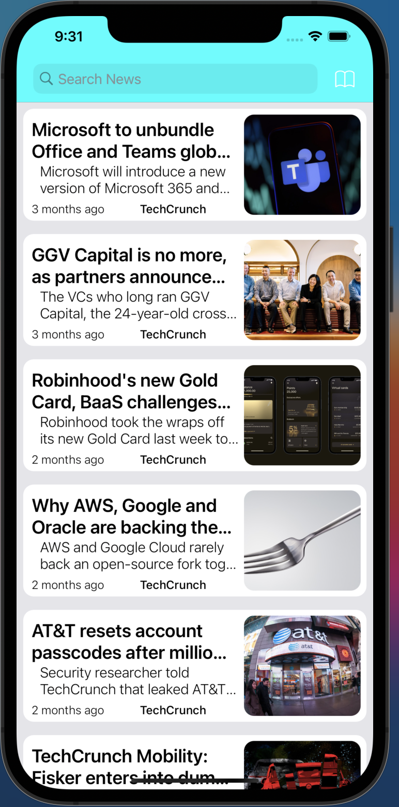

  <h1>  News Paper App</h1>

 
 

  

# News App 📰

This project is a news app developed in Swift using Xcode. It is my second project and aims to provide a user-friendly interface for accessing the latest news and updates. The app is designed to be visually appealing and easy to use, making it convenient for users to stay informed about current events. 💪

## Table of Contents
- [Features](#features)
- [Technologies Used](#technologies-used)
- [Getting Started](#getting-started)
- [Screenshots](#screenshots)
- [Acknowledgements](#acknowledgements)

## Features 🎉
- Browse and read the latest news articles 📰
- Filter news by category or topic 🔍
- Save favorite articles for later reading 📁
- Customizable user settings ⚙️

## Technologies Used 💻
- Swift 🐍
- Xcode 🛠️
- [Add any other relevant technologies used in the project]

## Getting Started 🚀
To get started with the app, follow these steps:
1. Clone the repository 📂
2. Open the project in Xcode 🖥️
3. Build and run the app on a simulator or device 📱

## Screenshots 🖼️
[Add screenshots of the app here]
Here is a demo of the App:

## Acknowledgements 🙏
[Add any acknowledgements or credits here]

Feel free to reach out if you have any questions or feedback about the app! 📢

