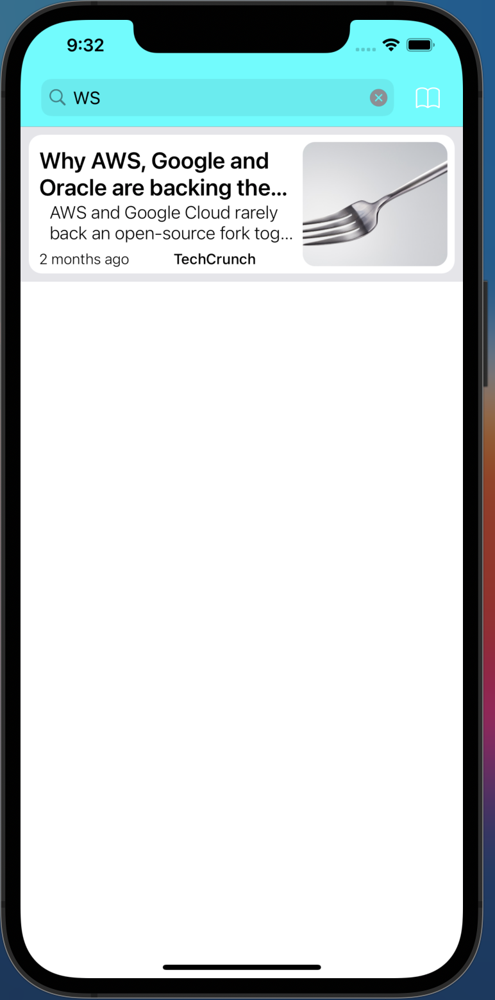

  <h1>
      📰
     
    News Fetcher App
  </h1>

 

  

# News App 📰

This project is a news app developed in Swift using Xcode. It is my second project and aims to provide a user-friendly interface for accessing the latest news and updates. The app is designed to be visually appealing and easy to use, making it convenient for users to stay informed about current events. 💪

## Table of Contents
- [Features](#features)
- [Technologies Used](#technologies-used)
- [Getting Started](#getting-started)
- [Screenshots](#screenshots)
- [Acknowledgements](#acknowledgements)

## Features 🎉
- Browse and read the latest news articles 📰
- Fuzzy search for news articles !
- View summary articles within the app.
- View the articles within the app with the builtin web-view browser !
- Filter news by category or topic 🔍
- TODO: Save favorite articles for later reading 📁
- TODO: Customizable user settings ⚙️

## Technologies Used 💻
- Swift 🐍
- Xcode 🛠️

## Getting Started 🚀
To get started with the app, follow these steps:
1. Clone the repository 📂
2. Open the project in Xcode 🖥️
3. Build and run the app on a simulator or device 📱

## Screenshots 🖼️
### Here is a demo of the App:

### FUzzy search !

### Choose your favorite news source category !

### View your news articles summary within the app 
(and you can still click on the link to open it within the app, thanks to built-in Saferi web viewer !)

## Acknowledgements 🙏
Credits:
- [AliAdam](https://github.com/AliAdam)
- (other contributers please refer to me, or my mastodon, and contact me to be added in credits)

Feel free to reach out if you have any questions or feedback about the app! 📢

